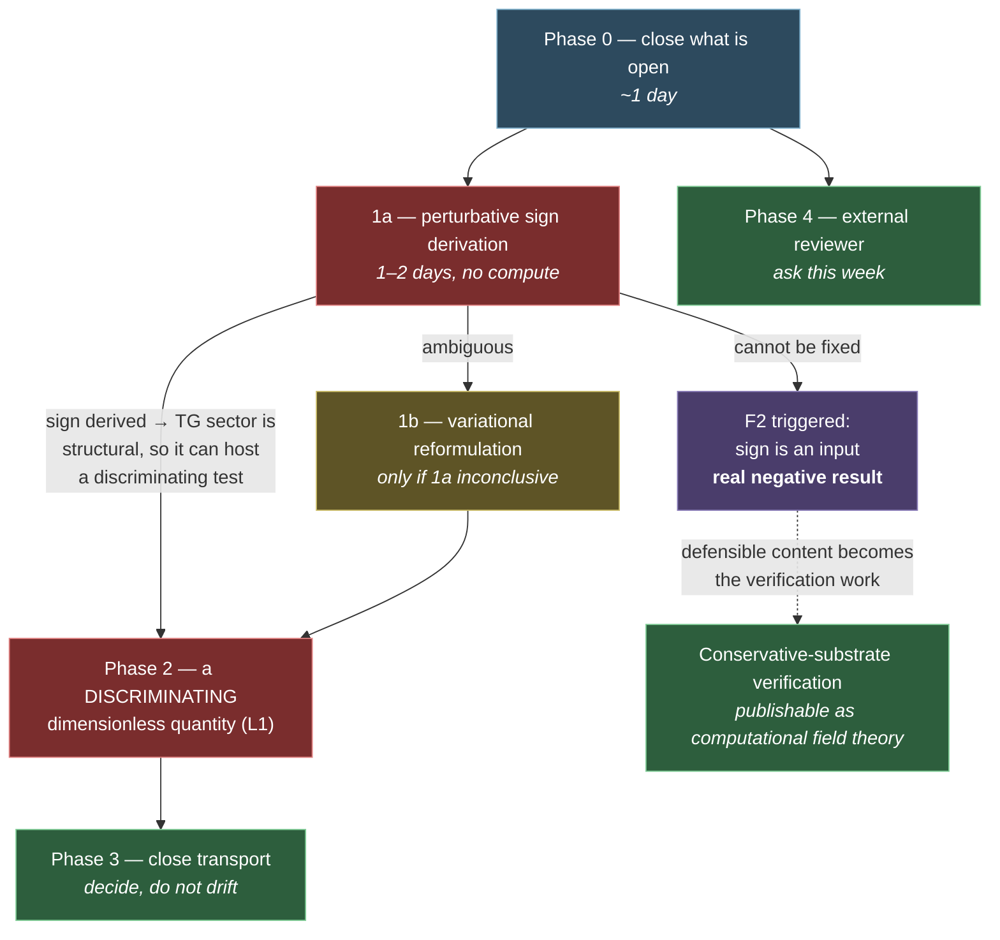

# Action Plan — from instrument work to validation

> [!warning] Superseded 2026-09-12
> **[[INTEGRATED_PLAN_2026-09]] is the operative plan.** This document remains valid as the record of
> *why* the phases are ordered as they are, and its Phase 1/2 reasoning is carried forward unchanged.
> What it lacks is the September research pass, the Derrick constraint on GAP-4, the retirement of the
> Townes target, and the promotion of V7 to a structure-transfer candidate.

Author: Claude, 2026-08-25. Synthesises [[SYSTEM_PRESSURE_TEST_AND_METHOD_REVIEW|the pressure
test]], [[META_ANALYSIS_BRANCH_PROGRESS|the meta-analysis]],
[[INFRASTRUCTURE_AND_ORCHESTRATION_ASSESSMENT|the infrastructure assessment]] and the P1/P1-a/P2
closures into one ordered plan.

---

## The situation in one paragraph

**The instrument phase is finished.** P1 classified the observable, P1-a supplied the energy
normalisation, P2 confirmed the force against a fully independent estimator to 0.34%, and the CI,
results index and provenance fixes now protect all of it. There is no remaining instrument question
blocking the science. **That means more instrument work would now be avoidance**, because the
pressure test established the real position: 16 free parameters, one external comparison yielding a
binary sign law, and a force whose *direction is a runtime flag rather than a derived result*.

Everything below is ordered by that.

---

## Phase 0 — close what is open (this week, ~1 day total)

Small, and all of it removes ambiguity that would otherwise contaminate later work.

| # | action | why now | effort |
|---|---|---|---|
| 0.1 | Work the [[Branch - Stability - Review Checklist]] | Already started (A1 ticked). The entire dissipative-substrate closure rests on 35 runs over three days with **no second reading**. If any of the five NULLs is wrong, later branch choices were made on bad information. | 2–4 h |
| 0.2 | **Decide the orchestrator's fate** | `orchestrator/` + `queue_runtime.db` (1,850 rows, all pointing at a dead `G:\` drive) will mislead the next reader into thinking it is live. Revive deliberately or delete. Either is fine; leaving it is not. | 15 min |
| 0.3 | Add *What changed as a result* to the ~10 load-bearing documents | **0 of 213 documents have one.** Start with the ones the catalog cites. Query: `SELECT * FROM v_docs_needing_consequences` | 1–2 h |
| 0.4 | Delete the stale second virtualenv (`venv/` alongside `.venv/`) if unused | A live footgun given the numpy-ABI breakage already seen | 5 min |

**Decision point:** if 0.1 overturns any stability NULL, stop and re-plan — the branch structure
would be wrong.

---

> [!important] Update 2026-09-12 — external research answered, two items closed
> A literature pass (`D:\Resource-Library\RESEARCH FINDINGS - Quantule Mapper Discriminating
> Evidence.md`) answered all five science questions, and two follow-ups were settled immediately in
> [[gravity_maturity/DERRICK_SCALING_AND_TARGET_TRIAGE]]:
>
> - **Phase 1a is corroborated from the outside.** In the nearest known relative (analogue-gravity
>   acoustic metrics) the metric's sign is **derived** from the fluid's equations of motion, not
>   chosen. The literature shows no case where a sign was legitimately left free after a proper
>   derivation. The project's free `a_sign` is anomalous relative to its closest analogue — which is
>   evidence that the derivation will resolve it rather than confirm the freedom.
> - **Phase 1b now has a constraint.** Derrick's theorem applies to C2′ unchanged — the density-
>   dependent kinetic weight `Ω(ρ)` contributes no factor under dilation (verified numerically to
>   5 d.p.). **A variational reformulation must use a Q-ball ansatz, not a static one.**
> - **Phase 2 gained a concrete first target and lost one.** The saturation cliff should be checked
>   for a **critical exponent** against Choptuik universality (γ≈0.37 for a massless real scalar) —
>   a critical exponent is dimensionless and parameter-free, which is exactly criterion 1+2. The
>   Townes critical-power target is **disqualified**: all 33 catalogued runs carry `s = −0.5`
>   (self-defocusing), placing the project on the cubic-quintic stable branch rather than near a
>   marginal collapse threshold.
> - **The secular drift has a cheap discriminating test:** does the drift rate scale down under
>   dt-halving and resolution-doubling (numerical) or not (physical phase-detuning)? The integrator
>   is RK4, which is not structure-preserving, so there is a real prior for the numerical answer.

## Phase 1 — the sign problem (the scientific priority)

> [!danger] This is the single question that decides whether there is a result here
> `a_sign = +1` is a **runtime flag**, labelled "theory" in the source. Flip it, get repulsion,
> equally converged, equally antisymmetric. Until the direction is *derived*, the attraction is a
> modelling input elaborated by a very well-verified simulation — which is threat **T3**, and
> falsification condition **F2** in [[Main branch]].
>
> P2 removed the last excuse: the estimator is now trusted, so the free sign can no longer be
> attributed to instrument uncertainty.

### 1a. Perturbative hand-derivation of the two-body force — **start here**

Derive `F(sep)` analytically in the `ε_G → 0` limit and compare to the measured value.

**Why this is the right first move:** P1 measured `A_well_min ≈ 0.99993`, i.e. `ε_G·G ~ 7e-5`. The
system is **strictly in linear response** — the regime where perturbation theory is not an
approximation but essentially exact. This is the cheapest possible route to a *derived* sign, and it
needs no GPU at all.

| | |
|---|---|
| Method | Linearise `A = 1 + ε_G G`, solve the screened `T`/`G` sector for a static source, evaluate `F_R = −c²∫(∂ₓA)|∇φ|²` against the known Q-ball profile |
| Success | The sign falls out of the algebra rather than the flag, **and** the magnitude matches the measured −5.7e-05 to within the linear-response error |
| Failure that teaches something | The derived sign is ambiguous → the model genuinely does not fix it → **F2 is triggered** and that is a real, publishable negative result |
| Effort | 1–2 days of analysis; no compute |

### 1b. Variational reformulation (GAP-4) — only if 1a is inconclusive

Fixes the sign by construction and yields Noether conservation laws as free independent checks.
High value, high effort. **Do not start this before 1a**: if the perturbative derivation settles the
sign, the reformulation becomes a nice-to-have rather than a necessity.

---

## Phase 2 — name a *discriminating* dimensionless quantity (L1)

The pressure test promoted this from long-horizon to **the load-bearing goal of the programme**,
because it is the only thing that converts simulation into evidence about nature.

> [!danger] Correction, 2026-08-25 — parameter-free is not enough; it must also DISCRIMINATE
> An earlier version of this plan named the **π/2 phase-force crossover** as the leading candidate,
> on the grounds that it is dimensionless, parameter-free and substrate-independent. That was wrong
> in the way that matters.
>
> **π/2 is what standard soliton perturbation theory already predicts.** Karpman–Solov'ev (1981) and
> Gordon (1983) derive the two-soliton interaction analytically as `e^{−Δx}·cos(Δφ)`, and `cos(Δφ)`
> changes sign at exactly π/2. This project's own [[FUTURE_WORK_AND_EXTERNAL_VALIDATION_PLAN|external
> validation plan]] already names them as the "V1 target law".
>
> So matching Mitschke & Mollenauer on the crossover **angle** would confirm that the simulation is
> correct. It would **not** distinguish IRER from a fibre-optics textbook. **A prediction is evidence
> only if the theory could have been caught being wrong**, and ordinary nonlinear optics gets to π/2
> first.

### The criterion

A candidate quantity must be **all four**:

1. **Dimensionless** — the model has no units, so only pure numbers can be compared.
2. **Parameter-free** — no freedom left to adjust after the fact.
3. **Measured** — a real experimental counterpart exists.
4. **Discriminating** — **standard nonlinear field theory does not already predict it.**

The fourth is the one that was missing, and it is the one that does the work.

### Where discriminating candidates must live

By construction, in **the part of the model with no standard counterpart** — the temporal↔geometric
coupling. Everything in the conservative substrates is, on current evidence, recovering known
nonlinear-field-theory phenomenology.

| # | action | effort |
|---|---|---|
| 2.1 | Enumerate every dimensionless, parameter-free quantity the model produces, and **for each, ask whether standard theory already predicts it**. Expect most of the conservative-substrate results to fail criterion 4. | half a day |
| 2.2 | Focus on TG-sector quantities with no standard analogue: the **saturation cliff** onset, the **screened mediator's falloff shape**, the **long-time drift** structure. Check each against the literature *before* running anything. | 1 day |
| 2.3 | For any survivor, state the prediction and its uncertainty **in advance**, then test it | varies |

### π/2 is still worth measuring — as a verification benchmark

Reclassified, not discarded. The simulation reproducing an analytic law it was never fitted to, in
**two substrates with different symmetry groups**, is first-rate evidence that the code is doing real
soliton physics. File it with `v = 2Dk` (0.9999) and conservation to 1e-13 — the verification
scoreboard, where it belongs and where it is genuinely strong.

> [!important] This raises the stakes on Phase 1
> If the TG force's sign is **derivable**, the temporal↔geometric sector produces something
> structural and non-standard — and that is where a discriminating prediction would come from.
> If it is **not** derivable, the sector's one distinguishing feature is a chosen input, and the
> project's defensible content is the conservative-substrate verification work.
>
> Phase 1 therefore decides whether Phase 2 has anywhere to go.

---

## Phase 3 — close the transport branch honestly

Three threads are OPEN and the branch has been silent since 12 July: C3 asymmetric-velocity energy
budget, C3 captured-remnant long-time fate, the C2 bounce→transmit boundary.

Per the meta-analysis, sectors here close by **burst-exhaustion rather than by decision**. Either
schedule these or write an explicit *"not pursuing, because…"* into
[[Branch - Transport - Index]]. **Either is acceptable; drift is not.** Note that Phase 2 may
reopen this branch anyway, since the crossover lives in it.

Effort: 30 min to decide; days if pursued.

---

## Phase 4 — external review (T10)

The most under-mitigated critical threat, and **the only one that cannot be fixed from inside**.
Every reviewer to date is Jake or an AI agent, and AI agents share priors and failure modes.

Options, roughly in order of accessibility:

1. **University supervisor or a physics postgrad** — the cheapest real adversary available, and
   this is a student project with access to one.
2. **Publish the verification work.** The conservative-substrate results (`v = 2Dk` to 0.9999,
   cross-substrate two-body universality, the collision diagram, the momentum-ledger estimator)
   are a legitimate computational-field-theory contribution **independent of IRER**. Submitting
   them gets genuine referees onto the method without requiring anyone to accept the theory.
3. **Independent re-implementation** from the equations alone.

Effort: hours to ask; months for route 2.

---

## What NOT to do next

Stated explicitly, because each is tempting and each would be avoidance:

- **More characterisation runs** (separation sweeps, phase maps, resolution studies). The
  instrument is trusted now; more of these do not address the sign or the validation gap.
- **P1-b (frozen-reference mass sweep).** Still queued and still reasonable, but P1-a showed the
  coupling fraction itself varies 29% non-monotonically — so a cleaner mass exponent would still
  not be interpretable. Deprioritised, not cancelled.
- **More infrastructure.** A1–A3 are built. The rest of the A-list is nice-to-have.
- **The gravity analogue as a target in itself.** Even a perfect emergent 1/r² from a 16-parameter
  model would not separate *"the theory is right"* from *"a flexible field theory can be made to do
  this."*

---

## Ordering rationale

**Phase 1a before Phase 2** because Phase 1 decides whether Phase 2 has anywhere to go. A
discriminating prediction has to come from the part of the model that standard nonlinear field
theory does not already cover — the temporal↔geometric sector — and that sector only counts as
structural if its force sign is *derived* rather than set by a flag.

**Phase 4 in parallel** because asking costs an hour and the answer may take weeks.

---

## What changed as a result

- **Code / model changes:** none yet — this is a plan.
- **Verdicts changed:** none.
- **What was done next, and why:** pending Jake's decision on Phase 0 and 1a.

## Issues raised

| # | issue | status | resolved by |
|---|---|---|---|
| 1 | Force sign is an input (T3 / GAP-4 / F2) — Phase 1 | OPEN | |
| 2 | No parameter-free dimensionless prediction (L1) — Phase 2 | OPEN | |
| 3 | Transport branch OPEN and dormant — Phase 3 | OPEN | |
| 4 | No independent human reviewer (T10) — Phase 4 | OPEN | |
| 5 | Orchestrator dormant, 1,850 stale rows — Phase 0.2 | OPEN | |
| 6 | 0 of 213 documents record their consequences — Phase 0.3 | OPEN | |

## Associated docs

- [[SYSTEM_PRESSURE_TEST_AND_METHOD_REVIEW]] · [[META_ANALYSIS_BRANCH_PROGRESS]]
- [[INFRASTRUCTURE_AND_ORCHESTRATION_ASSESSMENT]] · [[Main branch]] · [[RUN_QUEUE]]
- [[gravity_maturity/TG_P1_EVIDENCE_RECONCILIATION]] · [[gravity_maturity/TG_P1A_ENERGY_OBSERVABLE]] · [[gravity_maturity/TG_P2_MIDPLANE_STRESS_FLUX_RESULTS]]

## Branches

- [[Main branch]]

---

<!-- LINEAGE:BEGIN (generated by tools/build_doc_lineage.py - do not edit inside) -->

## Lineage — what changed after this

> [!info] Generated by `tools/build_doc_lineage.py` — regenerated on each build.
> It reports *that* later work exists, not *why* it happened. The reasoning belongs in
> the **What changed as a result** and **Issues raised** sections above, written by hand.

**Version written against:** `60093e5` (2026-08-27) — *Action plan: instrument phase closed, the sign problem is next*
**Revised since:** 8 commit(s), most recently `59b7ec3` (2026-09-12)

**Harness code changed since it was written:** 1 commit(s) to `jax_scout/`.
  - `caf61af` 2026-09-10 — Build HUD items 1+2: snapshot writer and universal field renderer

**Later documents that cite this one** — the downstream consequences:

- [[INTEGRATED_PLAN_2026-09]] &middot; `2026-09-12`
- [[RESOURCE_LIBRARY_ASSESSMENT_2026-09]] &middot; `2026-09-11`
- [[gravity_maturity/DERRICK_SCALING_AND_TARGET_TRIAGE]] &middot; `2026-09-12`

**Also referenced by (same date or earlier):** [[IRER_MASTER_HYPOTHESIS_CATALOG]], [[SESSION_SYNTHESIS_2026-08]], [[VISUAL_HUD_SCOPE_RFC]]

**The master catalog references this document** — the catalog is the authority on whether its verdict is still live:

> > `docs/ACTION_PLAN_2026-08.md` Phase 2 and `docs/SYSTEM_PRESSURE_TEST_AND_METHOD_REVIEW.md` §5.

<!-- LINEAGE:END -->
