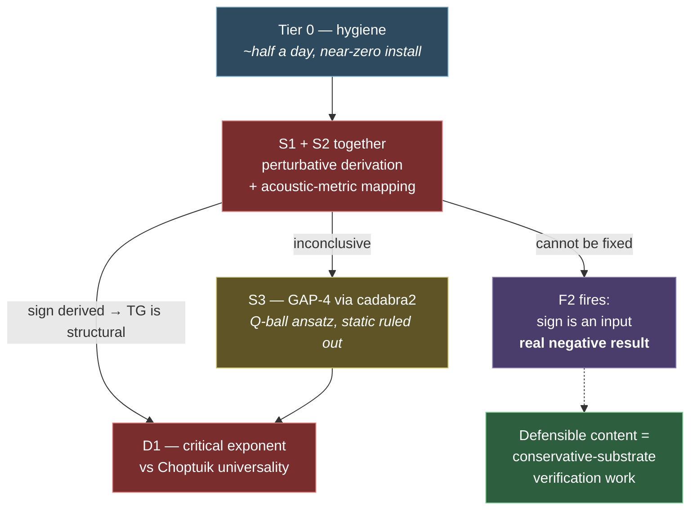

# Integrated Plan — September 2026

Author: Claude, 2026-09-12. **This is the operative plan.** It folds four documents and one external
research pass into one ordered list:

- [[ACTION_PLAN_2026-08]] — phases 0–4 (the scientific spine; still correct, now better supported)
- [[RESOURCE_LIBRARY_ASSESSMENT_2026-09]] — R1–R8 (tooling triage)
- [[VISUAL_HUD_SCOPE_RFC]] — items 6.1–6.5; **all five built and verified** — 6.1–6.2 in `caf61af`, 6.3–6.5 on 2026-09-16 (see §2a). H4 is closed. What remains is **C1**, the render backlog — a *use* item, not a build item.
- [[gravity_maturity/DERRICK_SCALING_AND_TARGET_TRIAGE]] — two items closed 2026-09-12
- The literature pass at `D:\Resource-Library\RESEARCH FINDINGS - Quantule Mapper Discriminating Evidence.md`

The earlier documents remain valid as records of *why*. This one says *what next*.

---

## 1. What the research changed

| item | before | after |
|---|---|---|
| **Phase 1a method** | hand derivation, assumed to be a fallback | **Confirmed correct.** No soliton-perturbation software exists — searched exhaustively across Hirota, reductive and adiabatic branches. `sympy` + Jakobsen 2013 is the realistic path. |
| **Phase 1a prior** | sign freedom, cause unknown | **In analogue gravity — the nearest known relative — the metric's sign is *derived* from the equations of motion.** No case found where a sign was legitimately free after a proper derivation. The project's `a_sign` is **anomalous relative to its closest analogue**, not merely untested. |
| **Phase 1b (GAP-4)** | open | **Constrained.** Derrick applies to C2′ unchanged; `Ω(ρ)` contributes no dilation factor. **Q-ball ansatz required; static ruled out.** |
| **Phase 2 primary candidate** | π/2 (retired), then nothing concrete | **Critical exponent of the saturation cliff vs Choptuik universality.** |
| **Phase 2 secondary** | Townes `p_cr ≈ 1.86` | **Retired** — all 33 runs at `s = −0.5`, the cubic-quintic *stable* branch, not a marginal threshold. |
| **Secular drift** | unexplained blocker | **Two named candidates and a cheap test.** Reclassified — see §2. |
| **Screening falloff** | "is it known?" | **Known: three distinct non-Yukawa mechanisms.** New, sharper question: which does `Ω²(ρ)` resemble? |

---

## 2. The filter that should govern Phase 2 from now on

The research's central deliverable is a **pattern**: a first quantitative contact in this class of
programme takes one of exactly two forms.

1. **Mathematical-structure transfer** — the new theory's governing equation is shown to take
   *literally the same form* as an already-tested theory. **This is the clean-win case** (analogue
   gravity → Hawking temperature, subsequently measured by Steinhauer in a BEC).
2. **Discreteness/counting argument** — yields an order-of-magnitude number that the field itself
   labels heuristic (causal sets → Λ). Real, made in advance, but weaker.

And three failure modes, all of which the project can now recognise: **resemblance without
discrimination** (already π/2's fate), **confound-blocking** (DSR's fate), and **fitted agreement**.

> [!important] Applying that filter reclassifies our own candidates
>
> | candidate | which pattern? | verdict |
> |---|---|---|
> | **Saturation cliff → critical exponent** | **structure transfer** — universality-class membership is exactly a structural claim | **Primary Phase-2 candidate** |
> | **V7 / acoustic metric** (already in `FUTURE_WORK`) | **structure transfer — and the clean-win form** | **Promoted.** See below. |
> | Screening falloff shape | structure transfer | Secondary; needs the mechanism-matching question answered first |
> | **Secular drift** | **neither** | **Not a Phase-2 candidate at all.** It is hygiene. Reclassified. |
> | Townes critical power | — | Retired |

### The promotion that matters: V7 is the structure-transfer route, and it was already on the books

The TG wave operator, exactly as coded
(`gravity_TG_B2_two_node_awell.py:69`, `div_A_grad`):

$$\partial_t^2\phi \;=\; \nabla\cdot\!\left(c^2 A\,\nabla\phi\right) - m^2\phi + U'(\rho)\phi$$

`c²A(x,t)` is a **position- and time-dependent squared propagation speed**. That is the acoustic-metric
form for a non-flowing medium — and analogue gravity is the one programme in the research's survey
whose first contact **discriminated cleanly and was subsequently confirmed by measurement.**

**This is not a new idea, and I should not present it as one.** The project's own
[[FUTURE_WORK_AND_EXTERNAL_VALIDATION_PLAN]] already names "Analogue-gravity acoustic metrics
(Unruh; Visser 1998); polytropic `a = (γ−3)/2` → **V7 target**."

**What is new is the connection nobody has drawn:** V7 has been filed as an *external-legibility*
item — a way to make IRER readable to physicists. The research's Request-1 pattern says it is
something considerably more useful than that:

- It is a **structure transfer**, the clean-win pattern, in a project that currently has no
  structure-transfer candidate at all.
- In that framework the effective metric is **derived from the equations of motion**, which is
  precisely what Phase 1a needs. **The acoustic-metric route may derive the force sign directly** —
  one piece of work serving both the #1 priority and the load-bearing Phase-2 goal.

> [!warning] Stated as a hypothesis, not a result
> That the operator *has* the acoustic form is a reading of the code and is solid. That the mapping is
> **exact** (that `c²A` is a genuine effective metric rather than merely a similar-looking coefficient),
> and that the sign falls out of it, are **unverified**. Both are checkable analytically in about the
> same effort as Phase 1a itself, which is why they should be done *together* rather than sequenced.

---

## 2a. Instrument state — what is already built, and what it now enables

The plan above repeatedly asks questions about the **spatial and dynamical behaviour** of `A`, `G`
and `φ`. As of `caf61af` there is an instrument for exactly that, and the plan should be using it
rather than treating it as leftover backlog.

### Built and verified (2026-09-10, commit `caf61af`)

| component | state | evidence |
|---|---|---|
| `jax_scout/snapshots.py` | **BUILT** — wired into the midplane harness behind `--snapshots`, **off by default** | `tests/test_snapshots.py`, 12 assertions on the non-perturbation contract. **End-to-end bit-exactness verified**: the same run with snapshots on vs off produced a byte-for-byte identical `stress_well.csv`; 30 frames written, 0 dropped, 0 failed; the OFF run created no snapshot directory. |
| `tools/render_fields.py` | **BUILT** — one view library, no per-campaign code | Three paths tested: HUD snapshot timeline, legacy pack montage (13 fields in one image), and the 856 MB memory guard. Output lands in `<run>/rendered/` and `build_run_catalogue.find_images` imports it — one path into the vault. |
| HUD 6.3 centroid overlay | **BUILT 2026-09-16** (H4 closed) | `find_centroids` + count-instability banner in `tools/render_fields.py`. Standard detector (`peak_local_max`), not a bespoke tracker. |
| HUD 6.4 live monitor | **BUILT 2026-09-16** | `tools/hud_monitor.py` — reader-only, no control path to the sim. Snapshot writes are now atomic. Verified against a live producer. |

Two design facts worth carrying forward because they de-risked the build: the harnesses **already**
force a device→host sync every sample (`float(d[k])` on jitted diagnostics), so capture rides an
existing sync rather than adding one; and measured cost is **0.214 MB/frame** at N=48 with five
fields, three planes and a volume every fifth frame.

### Where it plugs into this plan

> [!important] Four items below should be using the HUD, and the plan did not say so
>
> | plan item | what the HUD supplies |
> |---|---|
> | **S2** — acoustic-metric mapping | The snapshot writer **already captures `A_minus_1`** — the 7e-5 propagation-coefficient well the whole TG force rests on, stored offset from 1 so it can be amplified without losing precision to the leading digit. **Nobody has ever rendered it.** If `c²A` is an effective metric, this *is* the metric, and its geometry is directly viewable. |
> | **H2** — secular drift | A secular effect is a dynamical phenomenon; a movie is its natural instrument, as the RFC argued. The drift's *spatial structure* distinguishes a numerical pathology from phase detuning between T and G. |
> | **D1** — critical exponent of the saturation cliff | Threshold onset is a spatial event. Whether the approach is a smooth power law or a genuine discontinuity has a visual signature as well as a fitted one. |
> | **D3** — which screening mechanism | The question is literally about the **spatial shape** of `G` and `A`. The renderer already displays both. |
>
> None of these replaces the quantitative test. Each gives a second, independent channel on the same
> data — which is the entire justification for having built it.

### Stranded capability — built, but not reaching the plan

A systematic audit (2026-09-16) of what exists against what this plan references. Capability does not
live in documents, which is exactly the seam these fell through.

| stranded | reality | fix |
|---|---|---|
| ~~670 field packs, 0 rendered~~ | **CLEARED 2026-09-16.** 445 montages rendered and imported. Looking at them is also what exposed two centroid-detector defects the two-node test could not reach — a node near the boundary was invisible, and speckle fields were given six invented nodes (`39d486a`). | **C1 — done** |
| **102 paired-reading blocks seeded, 0 filled** | The protocol exists and has never once been used. The plan did not mention it at all. | **C2** below |
| `jax_scout/provenance.py` | **Wired into one harness only.** 29/183 runs carry recorded provenance, and those 29 are old CORE_SAT runs that stamped by coincidence. Every new run from the other ~125 harnesses still lands as `inferred`. A partial build that read as done. | **C3** below |
| `tools/build_results_index.py` | Unreferenced, yet **D1 and D2 both need to query it** — the `param_s` check that retired the Townes target was one of its queries. | referenced now |

| # | action | effort |
|---|---|---|
| ~~**C1**~~ | **DONE 2026-09-16.** 445 montages from 670 packs, 0 failures; 225 packs hold nothing renderable. Catalogue rebuilt — 203 run notes, **35 of them new**, because runs whose only artifact was imagery now classify as substantive. Figures stay local (36.5 MB, `docs/runs/_figures/` gitignored) until the project shifts from exploration to presentation. | done |
| **C2** | Work the paired-reading queue, newest first — it is the second channel [[SYSTEM_PRESSURE_TEST_AND_METHOD_REVIEW\|T10]] cannot otherwise supply. | ongoing |
| **C3** | Add `flat_stamp()` to the harnesses that actually produce catalogued runs (not all 126 — the ~6 that generate results). | 1 h |

> [!warning] The standing caution from the build itself
> **The visual channel generates hypotheses fast, including wrong ones.** The first legacy montage
> showed `R_current`/`R_lock`/`R_threshold` as uniformly flat, which looked like a real finding;
> checking all 66 samples showed them non-zero in 44/42/36 — sample 000 was simply an early frame.
>
> It also confirmed real physics in the same sitting: `A_minus_1` and `G` render as visually identical
> panels, which is `A = exp(ε_G G) ≈ 1 + ε_G G` seen by eye rather than derived — the linear-response
> regime made directly visible.
>
> Both belong in the record. **A visual read is a hypothesis, not a result**, and the same rule that
> governs a scalar contradiction governs a visual one: check it before reporting it.

---

## 3. The plan

### Tier 0 — hygiene, this week (~half a day, near-zero install)

Each closes an item that has been open longer than it should have been, and none is research.

| # | action | install | closes |
|---|---|---|---|
| ~~**H1**~~ | ~~Backend-parity check.~~ **DONE 2026-09-16 — and it was never actually open.** `tools/solver_parity_check.py` already existed and had already passed; the plan re-proposed it because the *procedure doc* is not named in the catalog, although the **verdict** is, at row **I3**. Re-run against current code: **rel-L2 1.735e-12**, `PARITY_WITHIN_TOL`, reproducing the original 1.7e-12 across 38 commits to `jax_scout/`. | none | I3 — now carries both dates |
| **H2** | **Secular-drift discriminator.** Does the drift rate scale down under dt-halving and resolution-doubling (→ numerical) or not (→ physical phase-detuning)? **The integrator is RK4, which is not structure-preserving, so there is a real prior for "numerical."** Run with `--snapshots` so the drift's spatial structure is visible alongside the scaling (§2a). | none | `TG_STATE_LOAD_LONG_TIME_DRIFT_UNRESOLVED` — reclassified out of Phase 2 and into hygiene |
| ~~**H3**~~ | ~~`mutmut` on the physics identities.~~ **DONE 2026-09-16 — and the answer was yes, they survived.** `tools/mutation_probe.py` injects ten mutations shaped like the ledger's own failures; **7 of 10 survived**, including a global polarity flip in the sector whose #1 open problem is a sign. Cause: every test pinned a *symmetry*, which those mutations preserve. Six value-pinning tests added → **10 of 10 caught**. See [[gravity_maturity/H3_MUTATION_PROBE_RESULTS]]. | none (mutmut not needed) | The claim in the record was mostly false; it is true now. |
| ~~**H4**~~ | ~~**HUD 6.3** — centroid overlay via `skimage.feature.peak_local_max`.~~ **DONE 2026-09-16**, together with 6.4 and 6.5. | none | The RFC item most likely to have caught C2.8b. Built with a count-instability banner, so the C2.8b signature is reported rather than smoothed. |

### Tier 1 — the sign problem, and its newly-paired partner

**This is the scientific priority and it now has two routes that should be worked together.**

| # | action | install | notes |
|---|---|---|---|
| **S1** | **Phase 1a — perturbative hand derivation.** Linearise `A = 1 + ε_G G`, solve the screened T/G sector for a static source, evaluate `F_R`. | `sympy` | Confirmed by the literature as the only available path. Jakobsen 2013 is the method reference. `A_well_min ≈ 0.99993` means linear response is essentially exact here. |
| ~~**S2**~~ | **DONE 2026-09-17.** Mapping is **EXACT** and the metric is *determined*, not fitted. The Gravity-D force law turns out to be **derived** (a geodesic), not a postulate — the project's first structure transfer. The **sign is not** derived: it is restated as "does a load lower the lapse" and lives in the non-variational part of the loop. See [[gravity_maturity/S2_V7_ACOUSTIC_METRIC_RESULTS]]. | none | Also closes **D3** negatively: none of chameleon / symmetron / Vainshtein. |
| **S3** | **PROMOTED 2026-09-17 — no longer conditional.** GAP-4 via `cadabra2`, with a Q-ball ansatz (Derrick rules out static). S2 showed the wave operator has given everything it has and the sign lives in the non-variational T–G coupling, so making that coupling variational is **the only remaining route**. | `cadabra2` | The Derrick constraint is a design input, not a surprise. |
| **S4** | Once a reduced ODE exists → integrate with `diffrax`, batched over separations and phases. | `diffrax` | JAX-native; shares the substrate. |

> [!danger] The decision point that governs everything after
> **If S1/S2 derive the sign** → the TG sector is structural, Phase 2 has somewhere to live, and V7
> becomes a live discriminating-prediction route.
> **If they cannot** → falsification condition **F2** fires: the sector's distinguishing feature is a
> chosen input, and the project's defensible content is the conservative-substrate verification work.
> That is a real, publishable negative result and should be treated as one, not as a setback.

### Tier 2 — the discriminating quantity

| # | action | install | notes |
|---|---|---|---|
| **D1** | **Critical-exponent measurement of the saturation cliff.** Does the approach to threshold follow a power law `M ~ \|p − p*\|^γ` with a measurable exponent, or is it genuinely discontinuous? Compare the *shape* against Choptuik universality (γ≈0.37 for a massless real scalar — the project's field content differs, so an exact match is not expected and is not the test). | none | **A critical exponent is dimensionless and parameter-free by construction**, satisfying two of Phase 2's four criteria for free. This is the primary candidate. |
| **D2** | **SALib Sobol analysis inside the confirmed a\* basin**, where the response is smooth. Converts threat **T2** from a count into a measured ranking *with interactions*. | `SALib` | The research's own caution applies: sampling is unreliable near sharp thresholds, and this project has one. **Basin only.** |
| **D3** | **Mechanism-matching for the screening falloff** — is `Ω²(ρ)` structurally a chameleon (density-dependent *mass*), a symmetron (density-dependent *coupling*), or Vainshtein (*derivative* self-interaction)? | none | One of the two items the research explicitly left open as needing judgement. Note that `Ω` is a **kinetic coefficient**, which matches none of the three cleanly — that may itself be the answer. |
| **D4** | **PySR + SISSO** as a blind cross-check of whatever S1 derives. | `pysr` | Two algorithmically distinct methods agreeing with a hand derivation is strong. |

### Tier 3 — deferred, with named triggers

| item | trigger |
|---|---|
| `Hypothesis` property tests | after H3 reports |
| MMS / dt-convergence via `sympy` | when `sympy` arrives for S1 |
| `svirl` / `exponax` / `py-pde` solver cross-check | if H1 shows a parity gap |
| HUD 6.4 **PyVista interactive 3-D viewer** | The 2-D live monitor is **built** (`tools/hud_monitor.py`); what stays deferred is only the *volumetric* viewer, for when a genuinely 3-D question needs it — e.g. **D3**, which is explicitly about spatial shape. It needs `--snapshot-volume-every`, which the writer already supports. |
| `cplot` / `complexplorer` domain colouring | opportunistic |
| `dynesty` / `UltraNest` | only once Phase 2 names a measurable to form a likelihood against |
| `pixi`, `Orbax` | if reproducibility or run-resilience becomes blocking again |

---

## 4. Retired — do not re-propose

| item | why |
|---|---|
| **π/2 crossover as a discriminator** | Karpman–Solov'ev / Gordon predict it. **Verification benchmark, filed beside `v = 2Dk`.** |
| **Townes critical power `p_cr ≈ 1.86`** | All 33 runs at `s = −0.5` — cubic-quintic stable branch, not a marginal threshold. |
| **Static-ansatz GAP-4** | Derrick applies unchanged; `Ω(ρ)` gives no evasion. |
| **Secular drift as a Phase-2 candidate** | Neither structure transfer nor counting argument. It is hygiene (H2). |
| `Aim`, `Sacred`, `Hydra`, `dynaconf`, `psutil`+`Supervisor`, `pyMultiobjective`, `MASA` | Per [[RESOURCE_LIBRARY_ASSESSMENT_2026-09]] §3. |
| **More characterisation runs** | The instrument is trusted. This would be avoidance. |

**One caution carried forward:** the BEC critical-atom-number target (`N_cr·\|a\|/a_ho ≈ 0.55–0.57`
mean-field vs `0.461 ± 0.012 ± 0.054` measured) is a **known beyond-mean-field discrepancy**, not an
open mystery. Using it as a target means competing with an explanation that already exists.

---

## 5. Ordering rationale

**Tier 0 first** because it is half a day and removes ambiguity that would contaminate later work.
**S1 and S2 together** because they are the same algebra and S2 is the project's only structure-transfer
candidate. **D1 after S1/S2** because whether the TG sector is structural determines what a critical
exponent would even mean.

---

## 6. The standing test, unchanged

> [!danger] Verification is still A, validation is still F
> The research pass did not change the underlying position: **16 free physics parameters against one
> external comparison yielding a binary sign law.** What it changed is that the project now has
> *named, filtered candidates* rather than an open search.
>
> Every item above must still answer: **does this advance validation, or add machinery?** Tier 0 is
> explicitly hygiene and is budgeted as such. Tiers 1 and 2 are the science. Tier 3 is deferred
> precisely so it does not quietly become the work.

---

## What changed as a result

- **Code / model changes:** none from this document. The instrument it now schedules against —
  `jax_scout/snapshots.py`, `tools/render_fields.py`, `tests/test_snapshots.py` — was built and
  verified in `caf61af` (§2a).
- **Verdicts changed:** none. Two open questions closed on 2026-09-12 (Derrick, Townes).
- **What was done next, and why:** pending Jake's decision on Tier 0.

## Issues raised

| # | issue | status | resolved by |
|---|---|---|---|
| 1 | Force sign is an input (T3 / GAP-4 / F2) | OPEN | S1 + S2 |
| 2 | No discriminating dimensionless quantity | OPEN | D1 |
| 3 | Is the acoustic-metric mapping exact? | OPEN | S2 |
| 4 | Which screening mechanism does `Ω²(ρ)` match? | OPEN | D3 |
| 5 | Backend-parity residual | OPEN | H1 |
| 6 | Identity-CI bug-catching power unmeasured | OPEN | H3 |
| 7 | Is the secular drift numerical or physical? | OPEN | H2 |
| 8 | No independent human reviewer (T10) | OPEN | unchanged — cannot be fixed internally |
| 9 | `A_minus_1` captured but never rendered | OPEN | S2 (§2a) |
| 10 | HUD 6.4 live monitor unbuilt | **CLOSED 2026-09-16** | `tools/hud_monitor.py`; only the 3-D volumetric viewer stays deferred |

## Associated docs

- [[ACTION_PLAN_2026-08]] (superseded by this document) · [[SYSTEM_PRESSURE_TEST_AND_METHOD_REVIEW]]
- [[RESOURCE_LIBRARY_ASSESSMENT_2026-09]] · [[VISUAL_HUD_SCOPE_RFC]] · [[FUTURE_WORK_AND_EXTERNAL_VALIDATION_PLAN]] — V7
- [[gravity_maturity/DERRICK_SCALING_AND_TARGET_TRIAGE]] · [[gravity_maturity/TG_P1_EVIDENCE_RECONCILIATION]]
- [[Main branch]] · [[IRER_MASTER_HYPOTHESIS_CATALOG]]

## Branches

- [[Main branch]]

---

<!-- LINEAGE:BEGIN (generated by tools/build_doc_lineage.py - do not edit inside) -->

## Lineage — what changed after this

> [!info] Generated by `tools/build_doc_lineage.py` — regenerated on each build.
> It reports *that* later work exists, not *why* it happened. The reasoning belongs in
> the **What changed as a result** and **Issues raised** sections above, written by hand.

**Version written against:** `59b7ec3` (2026-09-12) — *Integrated plan: fold the research pass into one operative plan*

**Later documents that cite this one:** none. *Either this line of work stopped here, or the consequence was never written down — both are worth knowing when reviewing it.*

**Also referenced by (same date or earlier):** [[ACTION_PLAN_2026-08]]

**Master catalog:** neither this document nor any verdict it reports appears in the catalog. Its status is **not tracked centrally** — treat anything inside as historical until confirmed.

<!-- LINEAGE:END -->
