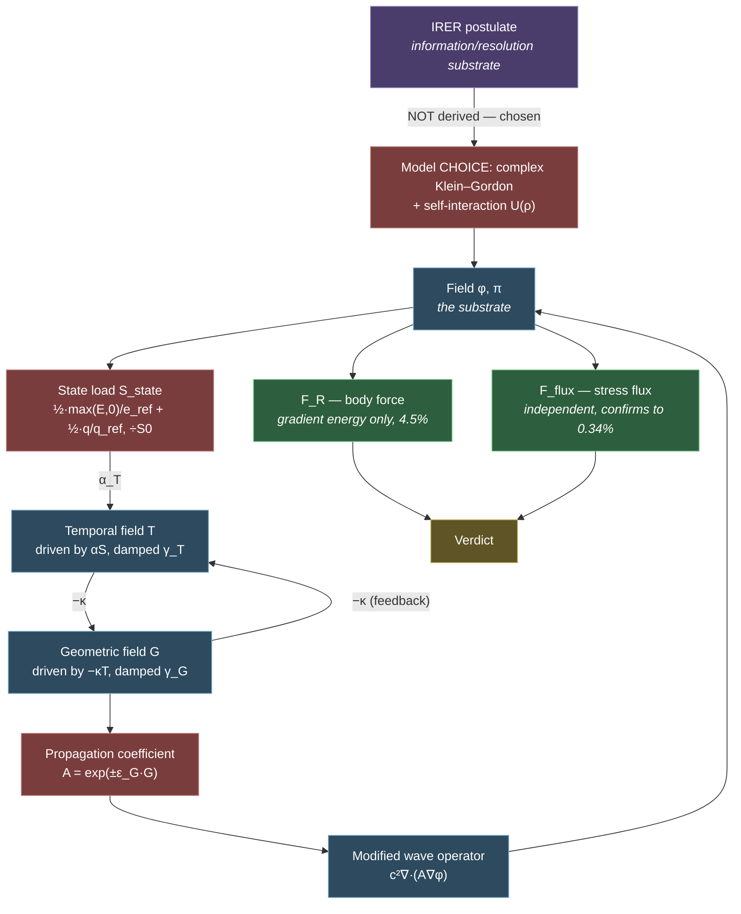
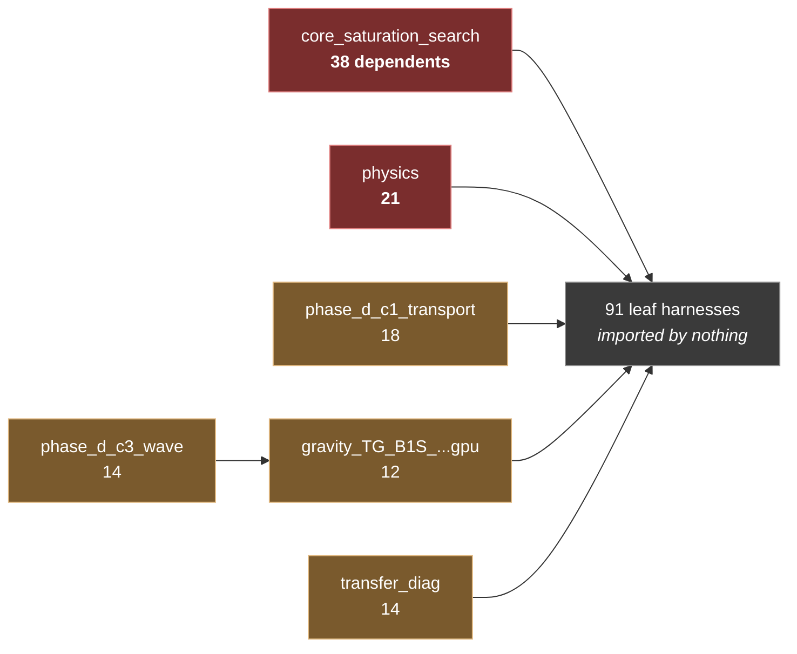

# System Pressure Test & Method Review

Author: Claude, 2026-08-25. An adversarial review of **the method**, not the results: the physics as
modelled, the choice to test it by simulation, the dependency structure that carries it, and what the
data could mean *even in its finished form*.

Measured against the system as it actually exists — 126 harness modules, 182 catalogued runs, 16 free
physics parameters, one external comparison.

> [!warning] Read this as a hostile referee would write it
> Everything below is what a competent, unsympathetic reviewer would say. Where the project is strong
> I say so plainly; where it is weak I do not soften it. Nothing here changes a verdict.

---

## 1. The dependency graph

### 1a. The physics chain — what depends on what

**Red nodes are free modelling choices, not consequences of the postulate.** There are four of them on
the critical path, and the chain `P → M` is the weakest link in the entire system: nothing forces the
IRER postulate to be realised as a complex KG field with this particular `U(ρ)`. A different realisation
is not ruled out by anything, which means **a null result falsifies the realisation, not the theory** —
and a positive result confirms the realisation, not the theory. §5 returns to this.

The `T ⇄ G` double arrow is the temporal–geometric feedback loop, i.e. goal **C3**. It is the only cycle
in the graph and it is the part that does not yet close at long times.

### 1b. The module graph — where a bug would propagate

126 modules in `jax_scout/`. Internal dependency counts:

| module | modules depending on it | role |
|---|---:|---|
| `core_saturation_search` | **38** | Phase C bare S-NCGL operator + sweep machinery |
| `physics` | **21** | shared physics primitives |
| `phase_d_c1_transport` | 18 | transport harness base |
| `transfer_diag` | 14 | diagnostics |
| `phase_d_c3_wave` | 14 | KG solver + `build_kg` |
| `gravity_TG_B1S_state_load_feedback_gpu` | 12 | TG source/T/G sector, `deriv_*`, `div_A_grad` |

**Two structural facts fall out of this:**

1. **`core_saturation_search` is a single point of failure for 38 modules.** All three bugs in the
   integrity ledger were in shared operators or shared observables. This is not coincidence — it is
   where bugs have the most reach and the least individual scrutiny.
2. **91 of 126 modules are imported by nothing.** They are entry-point harnesses, which is legitimate,
   but it means low code reuse: **8 modules define their own integrator** and **11 define their own
   energy or force observable.** An observable defined eleven times can be defined eleven slightly
   different ways. That is precisely the mechanism behind C2.8b (peak-tracking elasticity `e=3.21`) and
   behind the `F_R` weighting confusion that P1 had to untangle.

---

## 2. The central finding: verification is excellent, validation is absent

This is the one thing to take from this review.

**Verification** asks *are we solving the equations correctly?* **Validation** asks *are these the right
equations for reality?* They are different questions and the project is in radically different states
on each.

| | evidence | grade |
|---|---|---|
| **Verification** | `v = 2Dk` to 0.9999 (Galilean identity); E and U(1) charge conserved to ~1e-13; momentum ledger closes at exactly 2nd order; independent force estimator agrees to 0.340%; cross-platform determinism 7.9e-12; **three instrument bugs caught by chasing contradictions against known identities** | **A.** Better than much published computational physics. |
| **Validation** | one external comparison (Mitschke & Mollenauer 1987), verdict `WEAK_CLOSE_ANALOGUE_SIGN_LAW_SUPPORTED_NO_QUANTITATIVE_CLAIM` — a **sign law**, 7/7 on the usable series, explicitly no quantitative claim | **F.** Essentially nothing. |

> [!danger] More verification cannot substitute for validation
> This is the structural risk of the whole programme. Verification work is tractable, satisfying, and
> produces clean numbers — and the project is very good at it, so it generates a continuous supply of
> real-feeling progress. But **you can verify forever and learn nothing about the universe.** Every
> hour spent confirming that the code solves its own equations correctly is an hour not spent finding
> a point where the equations could be wrong about reality.
>
> The session that produced P1 and P2 was entirely verification. Both were the right calls — the
> instrument had to be trusted before anything else meant anything — but the balance must now shift.

**The arithmetic that makes this stark:** **16 free physics parameters** (`c, m, a, s, f, w, α_T, ω_T,
ω_G, γ_T, γ_G, κ_TG, ε_G, cT, cG, core_radius`) against **one external comparison yielding a binary
sign law**. A 16-parameter model can reproduce a sign law by accident. The model is currently
**under-constrained by external data by orders of magnitude.**

---

## 3. Threat register

Severity is *impact on the programme's conclusions*, not on any single run.

| # | threat | severity | present? | mitigation | status |
|---|---|---|---|---|---|
| **T1** | **Verification/validation conflation** — treating "the code is right" as "the theory is right" | **critical** | **yes, structurally** | Track them as separate scoreboards; require every campaign to name its validation content | **not mitigated** |
| **T2** | **Unfalsifiability via parameter freedom** — 16 free parameters absorb any result | **critical** | **yes** | Freeze parameters *before* a comparison; count degrees of freedom in every claim; prefer parameter-free ratios | partial (preregistration exists for gates, not for parameters) |
| **T3** | **Confirmation by construction** — the answer is an input | **critical** | **yes, confirmed** | `a_sign` is a runtime flag; a variational formulation would fix the sign by structure | **identified, not fixed** (GAP-4) |
| **T4** | **Instrument artifact** — a bug produces a physical-looking result | high | **3 confirmed, all caught** | Identity checks; the integrity ledger; second estimators | **well mitigated** — the project's strongest defence |
| **T5** | **The simulation becomes the theory** — code as the definition, so the theory can't be wrong, only the code | high | **yes, latent** | Maintain an equation-level statement independent of the implementation; require independent re-derivation | weak — the maths traceback exists but the code is the operative definition |
| **T6** | **Analogy inflation** — "gravity-like" drifting into "gravity" | high | guarded | The standing posture; the `CLOSE ANALOGUE` ceiling; the labelling-discipline correction | **well mitigated** — posture is enforced consistently |
| **T7** | **Garden of forking paths** — gates or classifiers tuned after seeing data | high | **partly** | Preregistered gates; but two C2.10 thresholds were corrected mid-flight, and the stability gates' calibration order is unverified | partial — item A7 of the stability checklist |
| **T8** | **Shared-core bug propagation** — 38 modules inherit one operator | high | **yes, structural** | Freeze + byte-identical rule; the C2.6 `param_geom_off` pattern | partial — freezing helps, but 11 duplicate observables cut against it |
| **T9** | **Small-N statistics** — 5-point power laws, R²=0.11 quoted as exponents | medium | **yes, confirmed** | P1-e retired single-exponent quotes; sem/σ now reported | **newly mitigated** (this session) |
| **T10** | **Reviewer scarcity** — one author plus AI agents that share priors and failure modes | **critical** | **yes** | Codex cross-audits; the paired-reading protocol | weak — see below |

> [!danger] T10 deserves more weight than it usually gets
> Every reviewer of this work so far is either Jake or an AI agent. AI agents share training, share
> priors, and share failure modes — Codex and I are **not** independent referees of each other in the
> way two human physicists would be. The paired-reading protocol helps within a session; it does not
> substitute for someone with different priors who wants the result to be wrong.
>
> This is the most under-mitigated critical threat on the register, and unlike the others it cannot be
> fixed from inside the project.

---

## 4. Is simulation the optimal method here?

**For the stated question, yes — and it is close to the only available one.** There is no analytic
tractability for a nonlinearly coupled three-field system, and no experiment. Simulation is not a
compromise here; it is the instrument.

**But the method is currently optimised for the wrong objective.** Effort is going into *characterising
the model* (how does the force vary with separation, mass, phase, box, resolution) rather than into
*finding a point where the model could be caught being wrong about reality*. Those are different
activities and the first does not converge on the second.

Four complementary methods are available and under-used:

| method | what it would buy | cost | why it matters |
|---|---|---|---|
| **Variational reformulation** | Fixes the sign by construction (kills T3); yields Noether conservation laws, which are **free independent checks** (helps T4, T8); makes the theory statable without the code (helps T5) | high — a genuine re-derivation | **The single highest-value structural move available.** It attacks three critical threats at once. |
| **Analytic perturbative reduction** | Derive the two-body force law by hand in the weak-coupling limit; compare to the measured one. The A-well is a 7e-5 perturbation — this is *exactly* the regime where perturbation theory works | medium | Would turn a simulated number into a *derived* one, and give a second fully independent check |
| **Dimensionless-ratio hunt** (goal L1) | Name one number the model predicts with no remaining freedom | low–medium | **Without this, no amount of simulation can ever constitute evidence about nature.** See §5. |
| **Independent re-implementation** | Someone implements from the equations alone and compares | medium | The only real defence against T5 and T8 |

---

## 5. What could this data mean, even in its final form?

The most important question asked, and it deserves an unsentimental answer.

### What a simulation of a postulated substrate can establish

1. **Existence** — *a substrate of this class can produce behaviour X.* This is real and non-trivial.
   The project already has it: conservative substrates produce localized structures that translate
   inertially, interact, and bind, with a substrate-independent two-body law. That is a genuine result
   about a class of nonlinear field theories.
2. **Necessity and sufficiency within the model** — which ingredient is load-bearing. The `off`-arm
   nulls and ablations do this well.
3. **Internal consistency** — the theory does not contradict itself when made concrete.

### What it can never establish on its own

**That reality uses this substrate.** A simulation is a deduction from assumptions; it returns exactly
what was assumed, elaborated. It becomes evidence about nature only at the moment it makes a **risky,
quantitative, parameter-free prediction that is then checked against measurement** — and could have
failed.

### The metric that decides the programme's value

> [!important] Derived-versus-fitted is the whole ballgame
> **Every parameter tuned to achieve a match contributes zero evidential value.** Only quantities that
> were *fixed in advance* and then matched count as evidence.
>
> Current standing: **16 free parameters, 0 parameter-free quantitative predictions checked against
> measurement.** One sign-law analogue explicitly carrying no quantitative claim.
>
> If the programme ended today, the honest summary would be: *a self-consistent, carefully verified
> 16-parameter nonlinear field model that exhibits emergent localized structures, inertial transport,
> a phase-dependent two-body law, and a short-range attraction whose direction is an input — with no
> established quantitative contact with measurement.* That is a real contribution to computational
> field theory. **It is not evidence about the universe, and no additional simulation of the same kind
> would make it so.**

### The end state worth aiming at

The strongest achievable claim, and it is genuinely achievable:

> *This substrate, with parameters fixed by [independent constraints], predicts dimensionless quantity
> R = [value]. The measured value is [value]. The prediction had no freedom to be adjusted.*

**One such number is worth more than a thousand runs of characterisation.** That is goal **L1**, and
this analysis promotes it from "long-horizon" to **the load-bearing goal of the entire programme** —
because it is the only thing that converts the work into evidence.

The corollary is uncomfortable and worth stating: **the gravity analogue (C4) is not the highest-value
target.** Even a beautiful emergent 1/r² would be a 16-parameter model reproducing a known law, with
no way to distinguish "the theory is right" from "a sufficiently flexible field theory can be made to
do this." A single parameter-free dimensionless match is worth more.

---

## 6. What is working, and should not be changed

A hostile review that only finds fault is a bad review. These are genuine strengths, rare in
single-author computational research:

- **The integrity ledger.** Three bugs caught by chasing contradictions against known identities rather
  than accepting convenient nulls, each of which had already changed published verdicts. The standing
  rule — *a null that contradicts a symmetry is an instrument fault until proven physical* — is the
  single best piece of methodology in the project.
- **Willingness to retract.** Four "pinning" verdicts retracted after C2.6. Whole branches nulled
  (prime-resonance, TDA, routing, Payan) and recorded as such.
- **Preregistration of outcomes**, including the outcomes that would be unwelcome. The P2 harness
  preregistered its own disagreement case.
- **The standing posture**, enforced consistently across ~200 documents.
- **Mirror-first with a frozen baseline.** Exactly right for T8.

---

## 7. Recommendations, in priority order

| # | action | attacks | effort |
|---|---|---|---|
| **1** | **Name one candidate dimensionless ratio** the model could predict parameter-free. Even a bad candidate makes the question concrete. | the programme's entire evidential value | low |
| **2** | **Attempt the variational reformulation** (GAP-4). Fixes the sign, yields Noether checks, states the theory without the code. | T3, T4, T5, T8 | high |
| **3** | **Count degrees of freedom in every claim.** Add "parameters free / parameters fixed / observations matched" to result templates. | T2 | low |
| **4** | **Perturbative hand-derivation of the two-body force** in the ε_G→0 limit, compared to measurement. | T3, T5 | medium |
| **5** | **Consolidate the 11 duplicate energy/force observables** into one audited module. | T8 | medium |
| **6** | **Separate the two scoreboards** — track verification and validation as distinct progress metrics so the balance is visible. | T1 | low |
| **7** | **Seek one genuinely external reviewer.** Cannot be fixed internally. | T10 | out of project control |

Items 1, 3 and 6 are cheap and would change how every subsequent result is read. **Item 1 is the one
that matters most**, and nothing currently in the run queue advances it.

---

## What changed as a result

*To be filled when consequences land. This document is an assessment, not a result — its value is
entirely in what it changes.*

- **Code / model changes:** none yet.
- **Verdicts changed:** none. Nothing here alters a verdict.
- **What was done next, and why:** pending Jake's decision.

## Issues raised

| # | issue | status | resolved by |
|---|---|---|---|
| 1 | No parameter-free dimensionless prediction exists (T2, §5) | OPEN | |
| 2 | Force sign is an input, not derived (T3 / GAP-4) | OPEN | |
| 3 | Verification and validation not tracked separately (T1) | OPEN | |
| 4 | 11 duplicate energy/force observable definitions (T8) | OPEN | |
| 5 | No independent human reviewer (T10) | OPEN | |
| 6 | Stability gate calibration order unverified (T7) | OPEN | [[Branch - Stability - Review Checklist]] A7 |

---

## Associated docs

- [[META_ANALYSIS_BRANCH_PROGRESS]] · [[Main branch]] · [[IRER_MASTER_HYPOTHESIS_CATALOG]]
- [[gravity_maturity/TG_P1_EVIDENCE_RECONCILIATION]] · [[gravity_maturity/TG_P2_MIDPLANE_STRESS_FLUX_RESULTS]]
- [[gravity_maturity/CONCEPT_IMPLEMENTATION_AND_GAP_ANALYSIS]] — GAP-4 is threat T3
- [[FUTURE_WORK_AND_EXTERNAL_VALIDATION_PLAN]] — the external-legibility work this recommends expanding

## Branches

- [[Main branch]]

---

<!-- LINEAGE:BEGIN (generated by tools/build_doc_lineage.py - do not edit inside) -->

## Lineage — what changed after this

> [!info] Generated by `tools/build_doc_lineage.py` — regenerated on each build.
> It reports *that* later work exists, not *why* it happened. The reasoning belongs in
> the **What changed as a result** and **Issues raised** sections above, written by hand.

**Version written against:** `3eb93af` (2026-08-26) — *System pressure test: method review, dependency graph, threat register*
**Revised since:** 2 commit(s), most recently `60093e5` (2026-08-27)

**Harness code changed since it was written:** 1 commit(s) to `jax_scout/`.
  - `06edae5` 2026-08-27 — Fix run provenance: 30% -> 86% of runs now dated

**Later documents that cite this one:** none. *Either this line of work stopped here, or the consequence was never written down — both are worth knowing when reviewing it.*

**Also referenced by (same date or earlier):** [[ACTION_PLAN_2026-08]], [[INFRASTRUCTURE_AND_ORCHESTRATION_ASSESSMENT]], [[SESSION_SYNTHESIS_2026-08]]

**Master catalog:** neither this document nor any verdict it reports appears in the catalog. Its status is **not tracked centrally** — treat anything inside as historical until confirmed.

<!-- LINEAGE:END -->
