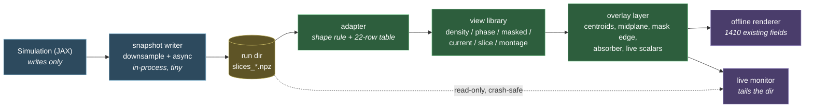

# RFC — Universal field HUD: offline renderer + live monitor

Author: Claude, 2026-08-25. Scopes a single rendering layer to replace the per-campaign renderers,
and a live monitor for running simulations. Written after auditing all 670 `.npz` field packs.

**This is a design proposal — an intention, not a result.**

---

## 1. The finding that makes this cheap

> [!important] 24 schemas, but only one structural rule is needed
> The 670 packs use **24 distinct key-sets**, which looks like 24 adapters' worth of work. It is not.
> **Every field in the corpus satisfies one rule: an array whose last three dimensions form a cube.**
> Tested against all 670 files — it finds **1,410 field arrays in 445 files** with no per-schema code.

| | |
|---|---|
| npz on disk | **26.3 GB**, 670 files |
| files containing at least one field | **445** |
| field arrays | **1,410** |
| distinct field key names | **22** |
| distinct *shapes* | ndim 3 or 4; N ∈ {32, 48, 96, 128}; dtype complex or float |

The 22 names are all recognisable and map to three semantic classes:

| class | keys | render as |
|---|---|---|
| **wavefunction** (complex) | `psi`, `psi0`, `psi_mid`, `psi_fin`, `psi_stable`, `psi_unstable`, `psi_1194`, `phi`, `Pi`, `fields` | density `\|ψ\|²`, phase `arg ψ`, phase-masked density, current |
| **real scalar** | `rho`, `rho_hist_*`, `S_state`, `energy_density`, `charge_density`, `phase_coherence`, `phase_gradient_cost` | signed heatmap, contours |
| **resolution/threshold** (TG) | `R_current`, `R_lock`, `R_threshold` | heatmap + threshold overlay |

**So the adapter layer is a shape rule plus a 22-row lookup table, not 24 bespoke readers.**

## 2. Why the current setup has friction

Nothing to do with the physics changing form. Every substrate is 3-D fields on the same uniform
periodic grid — `ψ` alone (S-NCGL, NLS), `(φ, π)` (KG), or `(φ, π, T, VT, G, VG)` (TG).

| # | cause | evidence |
|---|---|---|
| 1 | **Renderers are keyed on the campaign, not the view** | `quantule_viz/renderers/` holds five `phase_c*` variants. A new experiment needs a new renderer. |
| 2 | **The shared layer exists and is bypassed** | `plots.py` already has `as_density`, `density_slice`, `phase_current`, `vector_slice`, `render_frame_pack` — but `phase_c.py` imports only the bookkeeping helpers. **3,622 lines of campaign renderers against 208 lines of shared primitives.** |
| 3 | **The newer sectors have no renderer** | Zero for TG, C2, C3 — 85 runs |
| 4 | **The TG *force* runs save no fields at all** | `gravity_TG_B2_definitive_force`, `..._midplane_stress_flux`, `..._two_node_awell`: **0 field-save calls**. Scalars and CSVs only. |

**1,410 field arrays are on disk and nothing renders them.** Cause 4 is the one that matters most —
see §5.

## 3. Why this is an instrument, not a convenience

> [!important] The visual channel has different failure modes from the scalar channel
> All three bugs in the integrity ledger were caught by **scalar** contradictions against known
> identities, and each took days to weeks. **All three would have been obvious in a rendered field:**
>
> | bug | scalar symptom (how it was caught) | what a movie would have shown |
> |---|---|---|
> | **C2.6** `D_eff = D/151` | a linear packet failed to translate | the packet visibly not moving |
> | **C2.8b** peak tracking, `e = 3.21` | elasticity > 1 violates energy conservation | the tracked point jumping between merging cores |
> | **C3** boost IC missing carrier phase | `v_frac` constant in `v` | the density visibly not co-moving with the envelope |
>
> A reduction to scalars is a lossy projection chosen *in advance*. It can only catch what the
> projection preserves. Rendering the field is a **second, independent detector** — which is the same
> argument that made the P2 stress-flux estimator worth building, applied to a different channel.

It also serves the reverse direction Jake raises: showing that something we believed *was* happening
is an artefact, and revealing behaviour we assumed *was not* happening. The stability sector is
closed on five NULLs whose ~200 figures have **never had a second reading**
([[Branch - Stability - Review Checklist]]); a HUD makes that review tractable rather than heroic.

## 4. Architecture

### 4a. The rule learned from the previous HUD

Jake reports the earlier HUD failed on telemetry and button failures. The structural fix:

> [!danger] The HUD must be a READER, never a participant
> **No callbacks into the simulation. No buttons that control a run. No shared mutable state.** The
> simulation writes files; the HUD reads files. If the HUD crashes, hangs or is closed, the run does
> not notice — which matters when a run is 5.68 hours long and has already died three times to
> unrelated lifecycle problems.
>
> This is the same discipline as the frozen-baseline rule: the observer must not perturb the
> observed.

### 4b. Components

- **Adapter** — the only place substrate knowledge lives. Shape rule + name table. ~60 lines.
- **View library** — field-generic. Most of it already exists in `plots.py`; the work is *using* it.
- **Overlay layer** — where a HUD earns its name and where interpretation lives: node centroids, the
  midplane `x=0`, the mask boundary at `x=dx/2`, the absorber region, and the run's live scalars
  burned into the corner. **Overlays are what would have made the C2.8b tracker bug visible.**
- **Manifest** — three lines of config per run saying which views matter. Not a 400-line renderer.

### 4c. Snapshot cost (the live path)

At N=80, one complex128 field is 8.2 MB. Every sample × 801 samples = 6.5 GB — clearly not viable.
Two cheap options, both fine:

| strategy | per frame | 800 frames |
|---|---:|---:|
| 3 orthogonal slices, full res, complex64 | 0.15 MB | **123 MB** |
| full volume downsampled to 48³, complex64 | 0.88 MB | 705 MB |

**Recommendation: slices every sample, plus a downsampled volume every ~20 samples.** Slices catch
translation, breathing, merging and asymmetry — which covers every failure mode in the table above.

### 4d. GPU allocation — measured, not assumed

Hardware present: **GTX 1080 (8 GB)** and **Radeon RX 5500 XT**, two monitors attached.

> [!important] The split Jake wanted already exists, in its most useful form
> `nvidia-smi` reports the 1080 at **0 MiB used / 8059 MiB free** with two displays connected — so
> **the AMD card is already driving both monitors** and the 1080 is already a dedicated compute
> device with its full 8 GB available to JAX. Desktop compositing is not eating simulation VRAM.

**On running the renderer as ROCm/CuPy compute on the AMD card: blocked, and unnecessary.**

*Blocked* — the RX 5500 XT is **Navi 14 / gfx1012, RDNA 1**, which ROCm has never supported. ROCm
covers CDNA (MI series) and selected RDNA 2+ (gfx1030 and later, often needing
`HSA_OVERRIDE_GFX_VERSION`); ROCm-in-WSL2 is narrower again and does not include RDNA 1. This is an
unsupported-architecture wall, not a configuration difficulty. (It is probably also why
`docs/external research/ROCM_hip/` exists and went nowhere.)

*Unnecessary* — the renderer is not compute-bound:

| workload | size |
|---|---|
| 3 orthogonal slices at 80² | 19,200 pixels |
| full volume at 96³ | 884k voxels — CPU raycast well under 1 s |
| matplotlib PNG write | ~50–100 ms |
| **measured cadence, P2 run** | 2,403 samples in 2,473 s ≈ **1.0 s/sample** |

The renderer has ~1 s per frame and needs ~0.1 s. It is idle roughly 90% of the time at full
sampling rate. GPU compute buys nothing.

**Where the AMD card does earn its place: graphics, not compute.** An interactive 3-D viewer —
rotate the volume, scrub time, threshold live — is an OpenGL/Direct3D workload that the RX 5500 XT
handles through its ordinary graphics driver. PyVista/VTK or napari would run on it today with no
ROCm involvement. Graphics and compute are different paths; only the compute path is walled off.

**Resulting allocation:**

| device | role |
|---|---|
| GTX 1080 | JAX simulation, full 8 GB, untouched |
| RX 5500 XT | both displays (already) + interactive 3-D viewing |
| CPU | slice compositing and PNG writing — all the offline renderer needs |

> [!note] Device separation is not what protects the run
> The isolation that actually matters for a 5.68-hour job is **process separation** (§4a). A renderer
> in its own process cannot touch the simulation regardless of which chip it executed on. Splitting
> across devices is a bonus, not the safety mechanism — and pursuing it via an unsupported ROCm stack
> would trade a real day of work for a benefit the workload does not need.

## 5. What this does and does not do for the open questions

**Does not solve the sign problem.** That is analytic; no rendering derives a sign. Phase 1 of
[[ACTION_PLAN_2026-08]] stands unchanged.

**Does serve Phase 2 — the search for discriminating TG-sector phenomena.** The discrimination
criterion points at the temporal↔geometric coupling as the only place a real external test can live,
and that sector's distinguishing behaviours are all *dynamical and spatial*:

- the **saturation cliff** — a threshold phenomenon; what does the field do at onset?
- the **screened mediator's falloff shape** — directly visible as the geometry of `G`
- the **long-time drift** (goal C3) — a movie is the natural instrument for a secular effect
- the **A-well geometry** — at 7e-5 it is invisible unless amplified, and nobody has ever looked at
  whether the well sits where the chain diagram claims

> [!warning] The blocking gap
> **The TG force runs save no fields.** The sector where the crux lives has no visual data at all.
> Before any of the above is possible, `gravity_TG_B2_*` must write snapshots. That is a small change
> (§4c) and it is the **first step**, ahead of building the renderer.

## 6. Scope estimate

| # | item | effort | value |
|---|---|---|---|
| 6.1 | **Snapshot writer** — shared helper; wire into the TG harnesses | half a day | **unblocks everything else** |
| 6.2 | **Adapter + offline renderer** — shape rule, name table, reuse `plots.py` | 1 day | renders the 1,410 existing fields |
| 6.3 | **Overlay layer** — centroids, midplane, mask edge, absorber, scalars | half a day | where the bug-catching happens |
| 6.4 | **Live monitor** — separate process, tails the run dir (CPU; optional VTK/PyVista viewer on the AMD card) | half a day | Jake's live-grid request |
| 6.5 | Retire or wrap the five `phase_c*` renderers | half a day | removes the rebuild-per-campaign tax |

**~3 days total.** 6.1 and 6.2 deliver most of the value and are independent of the rest.

> [!note] Against the standing test
> [[INFRASTRUCTURE_AND_ORCHESTRATION_ASSESSMENT|The infrastructure assessment]] says every build must
> answer: *does this advance validation, or just add machinery?* This one is a genuine borderline
> case and should be judged honestly. It is **not** a parameter-free prediction and does not by itself
> move the evidential position. It qualifies because it is an **independent detector with different
> failure modes** (§3) and because it is a precondition for characterising the TG-sector phenomena
> Phase 2 needs (§5) — not because rendering is satisfying to build. If it starts growing features
> beyond §6, that judgement has been abandoned.

---

## Build status (2026-09-10)

**Items 6.1 and 6.2 are built and tested.** 6.3–6.5 remain proposed.

| item | state | evidence |
|---|---|---|
| **6.1 snapshot writer** | **BUILT** | `jax_scout/snapshots.py`, wired into the midplane harness behind `--snapshots` (off by default). `tests/test_snapshots.py`: 12 assertions on the non-perturbation contract. **End-to-end bit-exactness verified** — same run with snapshots on vs off produced a byte-for-byte identical `stress_well.csv`; 30 frames written, 0 dropped, 0 failed; the OFF run created no snapshot directory. |
| **6.2 adapter + offline renderer** | **BUILT** | `tools/render_fields.py`. Three paths tested: HUD snapshot timeline, legacy pack montage (13 fields in one image, no per-campaign code), and the 856 MB memory guard. Output lands in `<run>/rendered/` and `build_run_catalogue.find_images` picks it up — confirmed, one path into the vault. |
| 6.3 overlay layer | partial | midplane + mask-edge markers are in; centroids and absorber region are not |
| 6.4 live monitor | not built | the snapshot side exists, so this is now just a directory tail |
| 6.5 retire the `phase_c*` renderers | not built | |

**Simplification found during the build.** The RFC specified a 22-row name lookup. Probing every odd
key in the corpus (`psi_1194`, `fields`, `rho_hist_*`, `Pi`, `current`) showed a **dtype/prefix
classifier resolves all of them** — complex → wavefunction, `R_` prefix → resolution, else scalar.
The table was never needed.

**Cost measured, not estimated.** N=48, five fields, three planes plus a volume every fifth frame:
**0.214 MB/frame**. The RFC's N=80 slice-only estimate of 0.15 MB/frame stands.

> [!note] First look through the new instrument
> The very first snapshot montage showed `A_minus_1` and `G` as visually identical panels — which is
> `A = exp(ε_G G) ≈ 1 + ε_G G` confirmed by eye rather than by arithmetic, i.e. the linear-response
> regime made directly visible. It also showed `phi` developing a ring/shell structure by t=3 that is
> absent at t=0.1.
>
> A caution from the same session: the first legacy montage showed `R_current`/`R_lock`/`R_threshold`
> as uniformly flat, which looked like a finding. Checking all 66 samples showed they are non-zero in
> 44/42/36 of them — sample 000 is simply an early frame. **The visual channel generates hypotheses
> quickly, including wrong ones; it does not replace checking.**

---

## What changed as a result

- **Code / model changes:** none — this is a proposal.
- **Verdicts changed:** none.
- **What was done next, and why:** pending Jake's decision on 6.1.

## Issues raised

| # | issue | status | resolved by |
|---|---|---|---|
| 1 | TG force runs save no field snapshots | OPEN | 6.1 |
| 2 | 1,410 field arrays on disk, none rendered | OPEN | 6.2 |
| 3 | Five `phase_c*` renderers duplicate one view set | OPEN | 6.5 |
| 4 | Shared `plots.py` primitives bypassed by campaign renderers | OPEN | 6.2 |

## Associated docs

- [[ACTION_PLAN_2026-08]] · [[INFRASTRUCTURE_AND_ORCHESTRATION_ASSESSMENT]] · [[SYSTEM_PRESSURE_TEST_AND_METHOD_REVIEW]]
- [[Branch - Stability - Review Checklist]] — the review a HUD would make tractable
- [[IRER_MASTER_HYPOTHESIS_CATALOG]] §10 — the three bugs in §3

## Branches

- [[Branch - Validation - Index]]

---

<!-- LINEAGE:BEGIN (generated by tools/build_doc_lineage.py - do not edit inside) -->

## Lineage — what changed after this

> [!info] Generated by `tools/build_doc_lineage.py` — regenerated on each build.
> It reports *that* later work exists, not *why* it happened. The reasoning belongs in
> the **What changed as a result** and **Issues raised** sections above, written by hand.

**Version written against:** `3877db6` (2026-08-31) — *RFC: universal field HUD - offline renderer + live monitor*
**Revised since:** 2 commit(s), most recently `caf61af` (2026-09-10)

**Harness code changed since it was written:** 1 commit(s) to `jax_scout/`.
  - `caf61af` 2026-09-10 — Build HUD items 1+2: snapshot writer and universal field renderer

**Later documents that cite this one** — the downstream consequences:

- [[RESOURCE_LIBRARY_ASSESSMENT_2026-09]] &middot; `2026-09-11`

**Master catalog:** neither this document nor any verdict it reports appears in the catalog. Its status is **not tracked centrally** — treat anything inside as historical until confirmed.

<!-- LINEAGE:END -->
